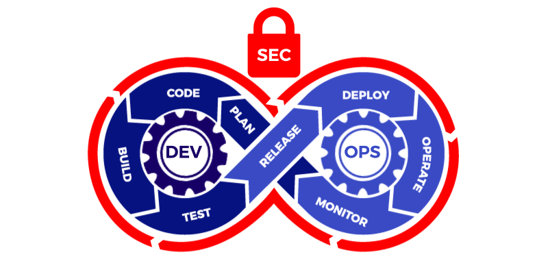

# Hi there! 👋 I'm Ismail

<h1 align="center">Hi 👋, I'm Ismail</h1>
<h3 align="center">I'm an Analyst Programmer with a passion for building software applications, and I have a keen interest in Data Science and MLOps.</h3>

  

  

- 🔭 I’m currently working on [Escapade](https://github.com/manou141/Escapade_27_Juin)

- 🌱 I’m currently learning **Laravel,React**

- 👯 I’m looking to collaborate on [LaraShop](https://github.com/manou141/LaraShop)

- 🤝 I’m looking for help with [LaraShop](https://github.com/manou141/LaraShop)

- 💬 Ask me about **Python, Java, Jakarta EE, Spring, Angular, .NET, Python, CICD, Microservices, AWS, Docker, BDD/TDD, Data Science, MLOps, and Linux.**

- 📫 How to reach me **igfloyd837@gmail.com**

<h3 align="left">Connect with me:</h3>

<h3 align="left">Languages and Tools:</h3>

   </a>                                           

&nbsp;

I'm an Analyst Programmer with a passion for building software applications, and I have a keen interest in Data Science and MLOps. My expertise includes Python, Java, Jakarta EE, Spring, Angular, .NET, Python, CICD, Microservices, AWS, Docker, BDD/TDD, Data Science, MLOps, and Linux.

### Skills and Technologies

📊 Analyste Programmeur
☕ Java
🌍 Jakarta EE
🌱 Spring
🔷 Angular
🌐 .NET
🐍 Python
🔄 CICD (Continuous Integration and Continuous Deployment)
🧩 Microservices
☁️ AWS (Amazon Web Services)
🐳 Docker
🧪 BDD/TDD (Behavior-Driven Development / Test-Driven Development)
🐧 Linux
📈 Data Science
🚀 MLOps (Machine Learning Operations)

### GitHub Stats

Feel free to reach out to me if you have any questions or want to discuss any interesting projects, especially related to Data Science and MLOps!

Looking forward to connecting with you! 😄
